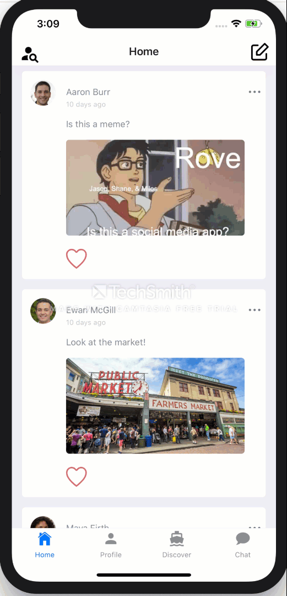

# Rove
Rove is a social media app for digital nomads, people who have embraced the traveling lifestyle due to the rapid expansion of remote work.

## About
Rove allows users, who sign-up for free profiles, to connect with other digital nomads via friend requests. It allows users to share pictures and stories of their travels and build out their own profile. 

Users can also chat in real-time with friends. 

To supplement sharing and chatting with friends, users can discover new cities, rate places they have visited, view users and a post feed of users in that city.

## Members
* Jason Hu
  * [LinkedIn](https://www.linkedin.com/in/jason-hu-dev/)
  * [Github](https://github.com/jhu32)
* Milos Djordjevic
  * [LinkedIn](https://www.linkedin.com/in/milos-djordjevic1/)
  * [Github](https://github.com/Milos60625)
* Shane Sweeney
  * [LinkedIn](https://www.linkedin.com/in/shanesween/)
  * [Github](https://github.com/shanesween)
  

## Technologies Used
* [React Native](https://reactnative.dev/)
* [Redux](https://redux.js.org/)
* [Cloud Firestore](https://firebase.google.com/docs)

## Setup
In order to run Rove on your mobile device, [Expo Client](https://apps.apple.com/us/app/expo-client/id982107779) must be downloaded.

In order to fully install all packages & dependencies:
`npm install` in your run time environment

`expo start` and have fun!
